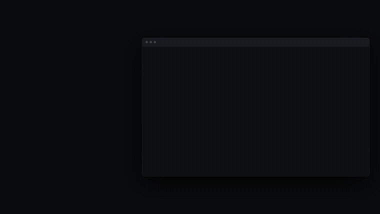

<div align="center">

# behalf

**Your agent has eyes. This gives it hands, in the browser you are already signed in to.**

[](LICENSE)
[](https://nodejs.org)
[](#install)
[](#install)
[](#tests)

[behalf-cli.vercel.app](https://behalf-cli.vercel.app)



</div>

No API keys. No sandbox browser that knows nothing about you. No screenshot
guessing. Nineteen commands your agent already knows how to run, in the session
where you are already authenticated.

```sh
behalf start 90                 # random port, closes itself after 90 minutes
behalf open app.example.com
behalf wait "Dashboard"         # wait for state, never for a fixed time
behalf click "New invoice"
behalf stop                     # closes the port. Do this.
```

## Install

One line. It checks what you have, fetches only what is missing, and touches
nothing outside `~/.behalf`.

```sh
curl -fsSL https://raw.githubusercontent.com/GKihlstadius/behalf-chrome-agent/main/get.sh | sh
```

<details>
<summary>What that actually does, before you pipe anything into a shell</summary>

1. Looks for Node 22 or newer. If you have it, it uses yours and downloads nothing.
2. If you do not, it fetches an official Node build from nodejs.org into
   `~/.behalf/node`. No sudo, nothing system wide, no change to your shell profile.
3. Checks that Chrome exists and tells you where to get it if not.
4. Clones this repo to a temp directory and runs `install.mjs`.
5. Links the `behalf` command into the first writable directory on your PATH,
   or creates `~/.local/bin` and tells you the one line to add.

`rm -rf ~/.behalf` removes all of it. Read [get.sh](get.sh) first if you would
rather not pipe a stranger's script into your shell, which is a reasonable
instinct for a tool that can act as you in your bank.

</details>

Prefer to do it by hand:

```sh
git clone https://github.com/GKihlstadius/behalf-chrome-agent
cd behalf-chrome-agent && ./install.sh
```

Then copy the one small file your agent host needs from [`adapters/`](adapters/):
Claude Code, Codex, Cursor and Zed are covered, and anything else that runs a
shell command works with the same text.

Check it landed:

```sh
behalf doctor
```

## One finding worth your time even if you never install this

**Chrome silently drops synthetic mouse clicks into a page it considers unfocused.**

Your terminal has the OS focus, not the browser. After the first navigation the
renderer decides the page is unfocused, and every real mouse click is swallowed.
No error is raised. Not from CDP, not from Chrome, not in the console. Your tool
reports a successful click at coordinates that are provably correct, and nothing
happens.

The first click of a session works, which is what makes this so expensive: it
looks like an intermittent bug in your own code. We measured the coordinates
against the element three separate times before accepting they had been right
all along.

`Page.bringToFront` does not fix it. `Input.setIgnoreInputEvents` does not fix
it. This does:

```js
await send('Emulation.setFocusEmulationEnabled', { enabled: true });
```

Send it when you attach. The effect lasts the session. If you are writing your
own CDP code, that one line will save you an afternoon.

## The part that actually matters

**[Read the FIELD MANUAL.](FIELD-MANUAL.md)**

The commands take five minutes to learn. The manual is the part that took a
week, because driving a real browser is not hard until it is:

- Two ways to click, and no rule about which one wins. An old government portal
  ignored DOM clicks entirely. A modern accounting app did the exact opposite.
- Business apps that render everything inside an iframe, where `read` sees the
  text but `click` finds nothing.
- Portals built from web components that return an empty document while
  displaying a full form.
- Downloads that silently do nothing because the behaviour was set on the page
  instead of the browser.
- Uploads that succeed while nothing has actually been submitted.

## Commands

| | |
|---|---|
| `behalf start [minutes]` | random port, closes itself when the time runs out |
| `behalf stop [--force]` | closes the port and the browser |
| `behalf doctor` | diagnose the whole setup |
| `behalf open <url> [ms]` | navigate, and say so when it fails |
| `behalf read [max]` | page text, shadow DOM included |
| `behalf wait <text> [--gone]` | wait for state, not for time |
| `behalf links [filter]` / `fields` | what is on the page |
| `behalf click <text> [--mouse]` | click by text, two ways |
| `behalf fill <name> <value>` | fill a field |
| `behalf upload <field> <file...>` | attach files |
| `behalf shot` / `pdf` | capture |
| `behalf frames` / `tabs` / `eval` | the rest |
| `behalf lease claim\|release\|list` | share one browser between agent sessions |

Flags: `--tab <match>` picks a tab, `--frame <match>\|*` works inside an iframe,
`--mouse` sends real mouse events, `--timeout <ms>` bounds a wait.

Every command exits non-zero when it did not do the thing, and says what to try
instead.

## Security

CDP has no authentication. Any process running as your user can connect to an
open port and act as you in every site you are signed in to. That is true of
every tool in this category, including this one.

behalf makes the window small and explicit rather than pretending otherwise:

- Random port on every start, bound to `127.0.0.1` only
- A separate Chrome profile, so your everyday browser is untouched
- `behalf stop` closes the port and nothing keeps running
- `behalf start 90` shuts itself down if you walk away and forget

**Close it when you are done.** An open control port is an open bank window.

## Tests

```sh
test/run.sh                 # 51 checks against a real Chrome and a local fixture
node --test test/unit.mjs   # the parts that differ per operating system
```

They use their own browser profile and their own state directory, so they are
safe to run while you are working.

## Honest comparison

This is a small tool in a crowded field, and most of the field is free:

| | What it is | Licence |
|---|---|---|
| [chrome-devtools-mcp](https://github.com/ChromeDevTools/chrome-devtools-mcp) | Google's MCP server, 29 tools, connects to your running Chrome | Apache-2.0 |
| [agent-browser](https://github.com/vercel-labs/agent-browser) | Vercel's Rust CLI, 50+ commands, `--cdp` to an existing browser | Apache-2.0 |
| Playwright MCP | Microsoft, full browser automation | Apache-2.0 |
| **behalf** | 19 commands, a command line, and a field manual | MIT |

Use whichever fits. Two reasons you might want this one:

**Context cost.** An MCP server loads its tool schemas into the model's context
on every request. chrome-devtools-mcp declares 29 tools, which measures 23,244
characters of JSON schema, roughly 6,600 tokens, paid on every message whether
or not the browser is involved. behalf costs one rule file of about 400 tokens,
because the model calls it the way it calls `git`. Roughly seventeen times less
context, left for the actual work.

**It is small enough to read.** 681 lines of plain JavaScript, no dependencies,
no build step. When a tool can act as you in your bank, reading all of it in an
evening is a feature.

## Local preview of the site

```sh
npx serve site
```

Not `python3 -m http.server`. It ignores Range requests, so the scroll-scrubbed
hero video cannot seek and freezes on the first frame. The page falls back to
looping playback so it does not look broken, but you will not see the real thing.

## Licence

MIT. Use it, change it, ship it.

## Support

behalf is free and staying that way. Nothing is gated. If it saved you an
afternoon, there is a coffee fund.

```
Bitcoin           bc1qf0aw36judg5qzjrf365rp9nq04nav5da8jjxzx
Ethereum ERC-20   0x9869799157186227bA3Cc980bAE3C64E022453a0
BNB Chain BEP-20  0x9869799157186227bA3Cc980bAE3C64E022453a0
Solana            DZ8Sh5rXDsnFL9G6WUYuJ6dELyHzKByWxKurGLY5Pt22
```

Ethereum and BNB Smart Chain share one address but are separate networks. Send
on the network you picked, or the funds are gone.
